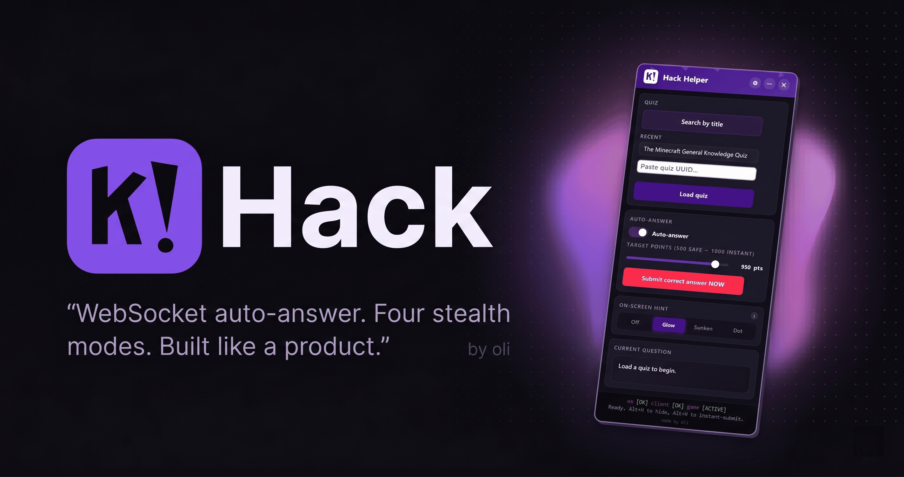

<div align="center">



# K!Hack

**A Kahoot answer helper that doesn't look like a 2018 userscript.**

WebSocket auto-answer with point control. Four stealth modes. A custom UI built like a real product.

[](https://schoooltools.vercel.app)
[](https://github.com/imoliverokay/kahack/stargazers)
[](https://github.com/imoliverokay/kahack/network/members)
[](https://github.com/imoliverokay/kahack/issues)
[](https://github.com/imoliverokay/kahack/commits/main)
[](LICENSE)

<br>

[**&rarr; Install in one click**](https://schoooltools.vercel.app)
&nbsp;&middot;&nbsp;
[Bookmarklet](#bookmarklet)
&nbsp;&middot;&nbsp;
[Userscript](#userscript)
&nbsp;&middot;&nbsp;
[Console](#console-paste)

</div>

---

## What it does

K!Hack joins itself to the Kahoot game you have open and quietly tells you which answer is correct, in whatever way you want it told. You can also let it auto-submit for you, with controllable jitter so the score lands where you want it instead of always pinning at 1000.

It is one obfuscated file. There is no server, no extension, no account. The whole thing runs in your tab.

### Highlights

- **WebSocket auto-answer.** It hooks Kahoot's CometD socket directly and replies with the correct choice on the same channel the official client uses. No fragile DOM clicking, no `dispatchEvent` games. Multi-select, true/false, and single-choice all work.
- **Point control.** Dial a target score (`950 pts` for the leaderboard) and the helper jitters its reply timing so you don't end up with a suspicious 1000-every-time.
- **Skip-Nth.** Auto-fail every Nth question on purpose so a teacher who's watching the board doesn't see a flawless run.
- **Four stealth modes.** Glow / Sunken / Dot / Off. You decide how loud the on-screen highlight is, or turn it off entirely and use only the panel.
- **Custom UI.** Drag, snap-to-corner, minimize, intro animation, settings modal with sliders and segmented controls, recent quizzes list, score tracker, toasts, countdown bar, confetti. None of it is `alert()`.
- **No fetch, no CDN.** The helper is inlined as base64 inside the install page so it works under `file://` and never pulls a remote URL at runtime.

---

## Install

Pick whichever way you actually use the internet.

### Bookmarklet

The friendly one. Drag once, click forever.

The easy way is the [live install page](https://schoooltools.vercel.app) &mdash; drag the **K!Hack** pill into your bookmarks bar. Then on any kahoot.it game tab, click the bookmark.

If you'd rather assemble it manually:

1. Open [`methods/bookmarklet.txt`](methods/bookmarklet.txt) and copy the entire contents.
2. Right-click your bookmarks bar &rarr; **Add page**.
3. Name it `K!Hack`, paste into the URL field, save.
4. Click it on any kahoot.it page.

### Userscript

For people with Tampermonkey, Violentmonkey, or Greasemonkey already installed.

1. Open [`methods/kahack.user.js`](methods/kahack.user.js).
2. Click **Raw**.
3. Your userscript manager will offer to install it.
4. The helper will auto-load every time you open kahoot.it.

You can disable it from the userscript manager menu when you don't want it loaded.

### Console paste

For the grown-ups.

1. Open [`methods/console.js`](methods/console.js) and copy the entire file.
2. On the kahoot.it tab, open DevTools (`F12` &rarr; **Console**).
3. If your browser is paranoid, type `allow pasting` first and press Enter.
4. Paste the code, press Enter.

---

## Hotkeys

| Key | Action |
| --- | --- |
| `Alt + H` | Hide / show the panel |
| `Alt + W` | Instant-submit the highlighted answer |
| `Alt + 1`&hellip;`Alt + 4` | Cycle stealth modes (Off / Glow / Sunken / Dot) |
| Drag the header | Move the panel; release to snap to the nearest corner |

The Alt+H and Alt+W bindings keep working even when the panel is hidden, so you can keep it off-screen and still pull it up at the moment you want it.

---

## How it works

K!Hack is one self-contained IIFE that runs inside the kahoot.it tab.

- **Quiz fetch.** You give it a quiz title or the public quiz UUID; it pulls the question/answer index from Kahoot's public quiz API.
- **Game pairing.** It watches the WebSocket the Kahoot client uses for the live game (`/socket/<gameId>`) and learns the active question index from incoming messages. That gives it a stable mapping from `questionIndex` &rarr; correct choice for the quiz you loaded.
- **Submit.** When you press `Alt + W` (or auto-submit fires), the helper constructs the same `/service/controller` envelope the real client sends &mdash; `{ type: "message", host, id: 45, content: { type, choice, questionIndex } }` &mdash; and writes it onto the existing socket. The server can't distinguish it from the official client because, as far as the server is concerned, it _is_ the official client.
- **UI.** The DOM panel is mounted into a fixed-position root with its own scoped CSS variables, so site styling can't bleed in. Stealth mode mutates the answer-tile classes on the live UI; "Off" leaves Kahoot untouched and you read the answer from the panel only.

There is no exfiltration. The helper makes one read against the public quiz API and never talks to anything else outside of Kahoot's own game socket.

---

## Compatibility

| Surface | Status |
| --- | --- |
| `kahoot.it` (desktop browser) | full support |
| Browser-based Kahoot mobile | works, panel is small &mdash; pull up a corner |
| `play.kahoot.com` | n/a (different surface, not targeted) |
| Native Kahoot mobile app | n/a (no DOM, no userscript runtime) |

Tested on current Chrome, Firefox, Edge, and Safari.

---

## What's in this repo

```
.
+-- README.md           // you are here
+-- methods/
|   +-- bookmarklet.txt   // the javascript: URI; paste into a bookmark
|   +-- kahack.user.js    // Tampermonkey/Violentmonkey/Greasemonkey userscript
|   +-- console.js        // paste-into-DevTools-console version
+-- images/
    +-- cover.png         // social-card / preview image
```

The source for the helper is intentionally not in this repo. It is shipped obfuscated so that random forks don't fragment into ten broken builds the day after a Kahoot deploy ships. The latest build always lives on the install page; this repo gets refreshed alongside it.

---

## Disclaimer

This is a study aid and a self-hosting browser modification. It runs entirely in the user's own browser tab, against game sessions the user has voluntarily joined. Do not use it in graded or proctored settings; do not use it to harass classmates or teachers. If your school's academic integrity policy says don't use answer helpers, that policy still says don't use answer helpers when it's purple and animated. You are responsible for what you do with this.

---

## Like it?

If this saved your grade, drop a star &mdash; it costs nothing and helps more people find it.

<a href="https://github.com/imoliverokay/kahack/stargazers"></a>

<a href="https://star-history.com/#imoliverokay/kahack&Date">
  
</a>

---

## Credits

Built by [oli](https://github.com/imoliverokay). Kahoot, the K! mark, and the brand colors belong to Kahoot! AS. This project is not affiliated with, endorsed by, or sponsored by Kahoot! AS.

<sub>Visitors: </sub>
